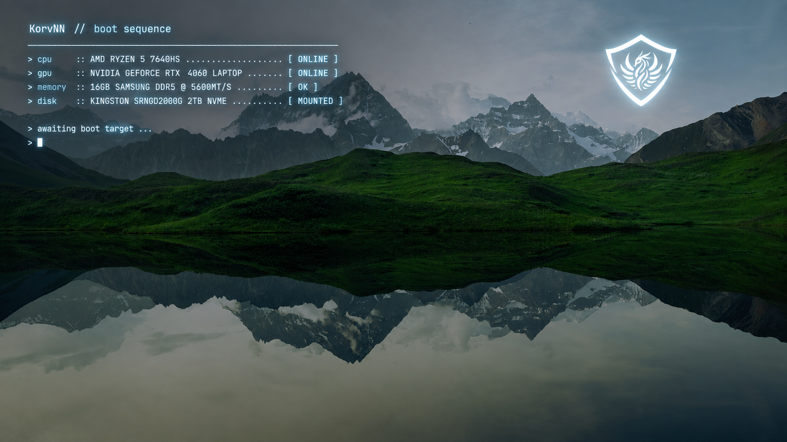

# rEFInd KorvNN Theme

A personalized 1920x1080 rEFInd theme with a mountain landscape, neon
hardware boot status, a glowing shield, minimalist white system icons, and a
custom CachyOS icon.

## Preview



## Features

- 1920x1080 rEFInd layout
- Personalized hardware status panel
- CachyOS icon aliases for `cachyos`, `arch`, and generic `linux` detection
- Minimal white operating-system and firmware icons
- Full-screen PNG background

## Installation

Copy the repository into the `themes` directory next to `refind_x64.efi` and
name the copied directory `rEFInd-KorvNN`:

```text
EFI/refind/
├── refind.conf
└── themes/
    └── rEFInd-KorvNN/
        ├── background.korvnn.png
        ├── icons/
        ├── selection_big.png
        ├── selection_small.png
        └── theme.conf
```

Then add this line to the end of `refind.conf`:

```text
include themes/rEFInd-KorvNN/theme.conf
```

The configured resolution is 1920x1080. Change the `resolution` line in
`theme.conf` if your firmware display uses another mode.

## Customization

- Background: `background.korvnn.png`
- Theme settings: `theme.conf`
- CachyOS aliases: `icons/os_cachyos.png`, `icons/os_arch.png`, and
  `icons/os_linux.png`

## License

Released under the MIT License. Copyright notices for adapted icon assets are
retained in `LICENSE`. CachyOS and other operating-system marks belong to their
respective owners.
